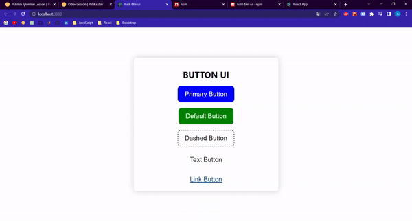

# halil-btn-ui

> Made with create-react-library

[](https://standardjs.com)

## Install

```bash
npm install --save halil-btn-ui
```

## Usage

```jsx
import React, { Component } from 'react'

import Button from 'halil-btn-ui'
import 'halil-btn-ui/dist/index.css'

class Button extends Component {
  render() {
    return <Button />
  }
}
```

## License

MIT © [hozdal](https://github.com/hozdal)

## Result
  
  